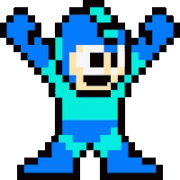

   

 

  
  

 

---

<h3 align="center">
  <samp>&gt; Hi, I am
    <b><a target="_blank" href="#">Ricky Hartono</a></b>
  </samp>
</h3>
 

   
✨ Name : **Ricky Hartono**  
🧿 Alias : **truecupzz / Ucupz3**  
🎂 Age : **18**  
🎓 College : **Politeknik Negeri Semarang (POLINES)**  

 

  
  
  

 

<brp align="center">
  

---

  
  

---
 

  

 
 

  

